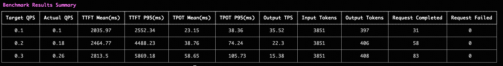

To help you quickly evaluate inference performance, we provide a benchmarking tool.

Main features:

- Support for specifying maximum and minimum QPS for batch benchmarking
- Support for HTTP OpenAI interface
- Rapid generation of benchmark results

## Getting Started
### Pull Docker image
```
docker pull ghcr.io/zhihu/zhilight/benchmark:1.0.0
```

### Start server

Currently only server benchmark is supported. You can refer to the following command to start the server:
```
python -m zhilight.server.openai.entrypoints.api_server [options]
```

### Run benchmark
You can refer to the following command to start a Docker container to run the benchmark task:

```bash
docker run --network host -it ghcr.io/zhihu/zhilight/benchmark:1.0.0 ./main --min_qps 0.10 --max_qps 0.30 --qps_step 0.10 --server_url http://127.0.0.1:8080/v1 --min_duration_s 300 
```

The above command will execute multiple benchmark tasks, with each task running for approximately 5 minutes. After all benchmark tasks are completed, it will output the following report:


### Configurations
We provide various CLI to customize benchmark tasks, including task duration and more.

Some main parameters:

- `--min_qps`: Minimum benchmark request QPS, default value is 0.1
- `--max_qps`: Maximum benchmark request QPS, cannot be less than min_qps
- `--qps_step`: Benchmark request QPS step size, default value is 0. Based on the set maximum QPS, minimum QPS, and QPS step size, each benchmark task will run one or more times
- `--server_url`: Model inference service url
- `--samples_path`: Benchmark data path, default test data is provided in the image and can be configured as needed
- `--output_path`: Path to save all request data during benchmarking, default is .
- `--is_stream_request`: Whether it is a streaming request, default is True
- `--min_duration_s`: Duration of each benchmark task execution (in seconds), minimum value is 60

## FAQ
### How to Construct Benchmark Data
We have packaged default benchmark data in the image, which you can customize according to your actual needs.

Currently, only single-file benchmarking is supported, save the request data as a 0.json file in the samples_path directory, which will be mounted when starting the container.

Assuming your request is:
```
client.chat.completions.create(
    messages=messages,
    model=model,
    stream = True
)
```
The script to construct the request data is:
```

data = dict(
    messages=messages,
    model=model,
    stream=True
)
prompts = json.dumps(data)
with open('0.json', 'w', encoding='utf-8') as f:
    f.write(prompts)
```
